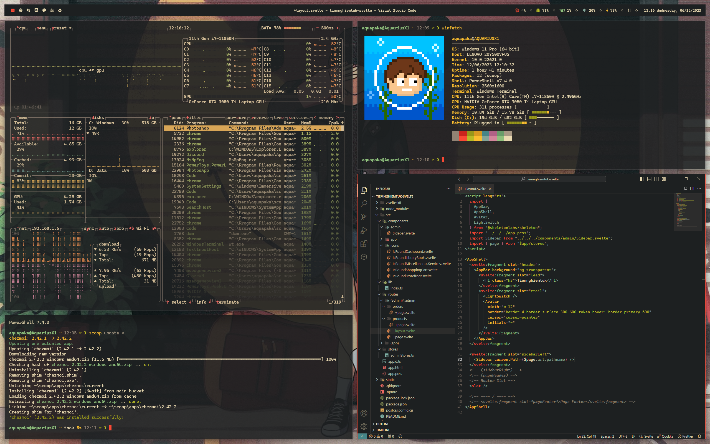
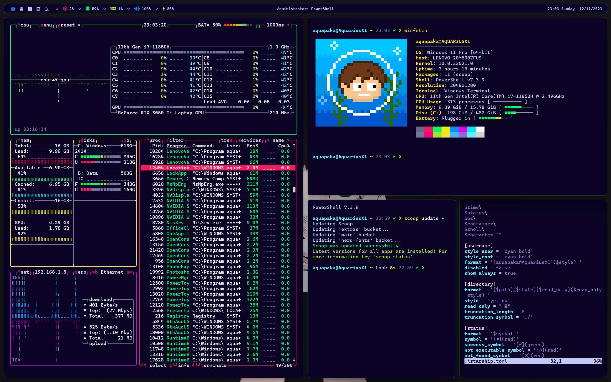

# Dotfiles

My dotfiles for windows 11

- Terminal: Windows Terminal
- Shell: Zsh inside MSYS2
- WM/Bar: GlazeWM
- Package manager: Winget
- Dotfiles managed using Chezmoi

## Themes

### ❤️ Meimei




<!-- ### 🕹️ Arcade (archived)


 -->

## Installation

### Install Font

Font need to be download and install: <a href="https://www.nerdfonts.com/font-downloads">CaskaydiaCove Nerd Font</a>

### Install packages

Run **install-packages.ps1** script with powershell

### Change MSYS2 home directory

Edit /c/msys64/etc/nsswitch.conf

```
db_home: windows
```

### Install Zsh

```
# Install ZSH
pacman -S zsh

# Install Theme: Powerlevel10k
git clone --depth=1 https://github.com/romkatv/powerlevel10k.git ~/.config/zsh/themes/powerlevel10k

# Install Syntax Highlighting Plugin
git clone https://github.com/zsh-users/zsh-syntax-highlighting.git ~/.config/zsh/plugins/zsh-syntax-highlighting

# Install Autosuggestions Plugin
git clone https://github.com/zsh-users/zsh-autosuggestions ~/.config/zsh/plugins/zsh-autosuggestions

# Install History Substring Search Plugin
git clone https://github.com/zsh-users/zsh-history-substring-search ~/.config/zsh/plugins/zsh-history-substring-search
```

### Add New Environment Variables

Add "C:\Users\aquapaka\.local\bin" to Path variables

### Optional

- Enable automatically hide the taskbar

### Other

- Food script by Xero: <https://github.com/xero/dotfiles>
