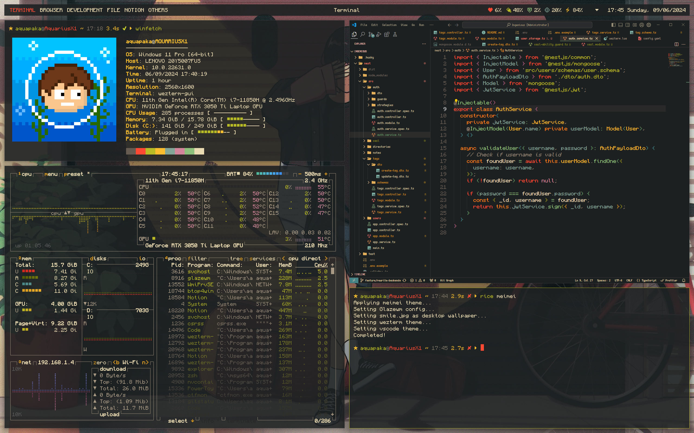
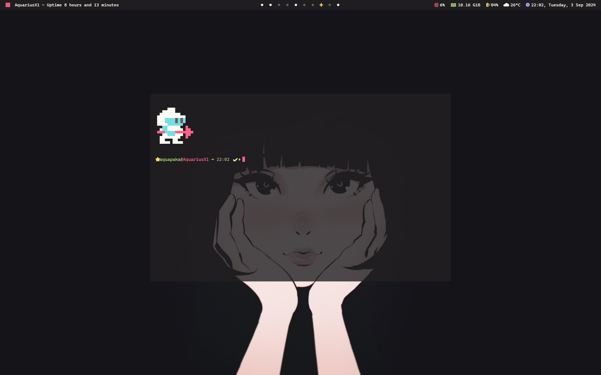
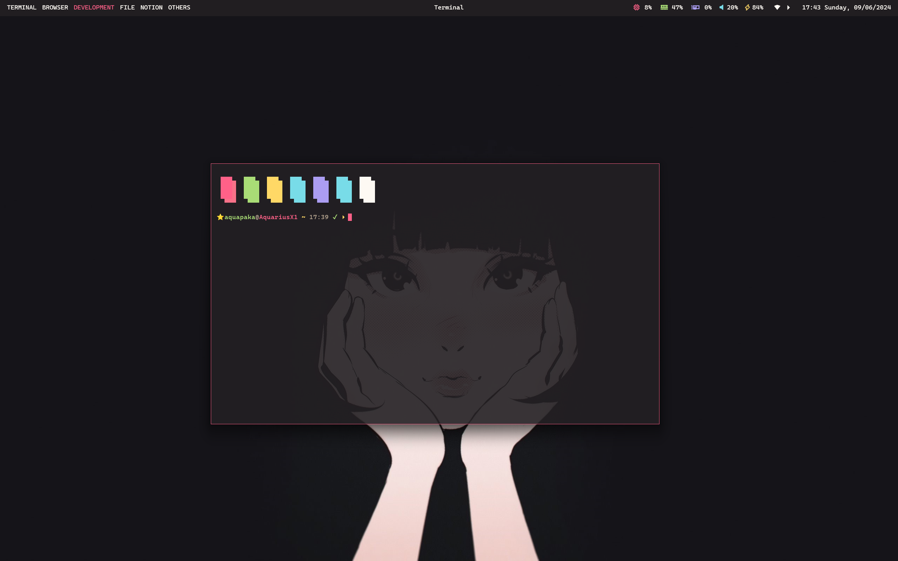
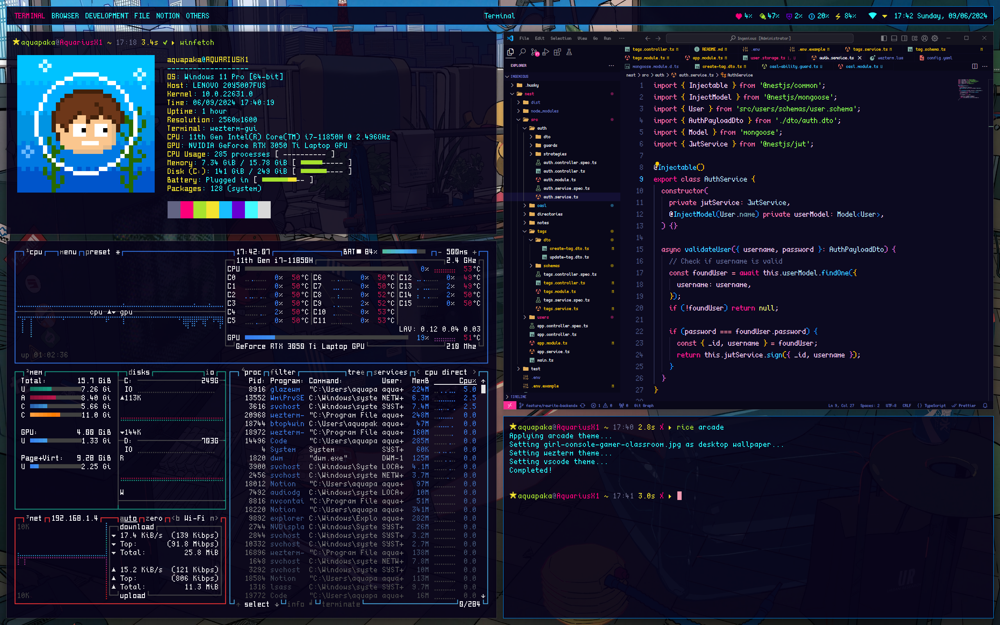

# 🍙 My Ricing Dotfiles for Windows 11

Yes it's **Windows**


## Introduction

### ❤️ For the Ricing and Unixporn Enthusiasts

Are you **a ricing nerd** or **a unixporn enthusiast** who has to use Windows but still misses the customizability of Linux? Look no further! This repository is a treasure trove of my ricing dotfiles tailored specifically for Windows.

### ⚙️ Custom Themes and Configurations

It includes a variety of custom themes, scripts, and configurations designed to bring the same level of aesthetic appeal and functionality to your Windows desktop that you love from your Linux setups.

### ⚡ Instant Theme Switching

Easily switch themes on the fly with just one press. Keep your desktop fresh and aligned with your mood or preferences instantly and effortlessly.

### 😍 Transform Your Windows Experience

Dive in, tweak to your heart's content, and transform your Windows environment into a beautifully riced masterpiece!

## Core

- Terminal: **Alacritty**
- Shell: **Zsh** inside MSYS2
- Tiling Window Manager: **Komorebi**
- Bar: **Zebar**
- Package manager: **Winget**
- Dotfiles manager: **Chezmoi**

## 🎨 Themes

| ❤️ meimei |
| :---: |
| Warming and caring |
||
||
||

| ❤️ tlinh |
| :---: |
| Only in my dreams |
||
||
||

| ❤️ mtram |
| :---: |
| Calming and peaceful |
||
||
||

| ❤️ arcade |
| :---: |
| ⚠️ WARNING! Only For Truest Gamer!! May hurt your eyes!!! |
||
||
||

| ❤️ khanhoa |
| :---: |
| She plays guitar |
||
||
||

## ⚙️ Current Configurable Settings

You can customize each theme inside ~/.rice-manager/rices and re-apply it (see **Change theme** below)

- ☑️ Alacirtty theme
- ☑️ Komorebi theme
- ☑️ Zebar theme
- ☑️ Desktop wallpaper based on rice
- ☑️ Vscode theme
- ☑️ Windows light/dark mode based on rice
- ✖️ Enable/Disable Rounded Cornors (⚠️Unstable)
- ❓ Discord theme
- 🚧 Btop theme
- 🚧 *under construction*

## 📑 Basic usage

### Change theme

- From alacritty terminal use command: ```rice <theme-name>``` (example: ```rice meimei```)
- Background is selected randomize from rice's wallpaper folder

### Useful keybindings

| Keys | Action |
|:-|:-|
|<kbd>alt</kbd> + <kbd>enter</kbd>| Open terminal|
|<kbd>alt</kbd> + <kbd>Space</kbd>| Open powertoy run |
|<kbd>alt</kbd> + <kbd>h\|j\|k\|l</kbd>| Focus window left \| bottom \| top \| right|
|<kbd>alt</kbd> + <kbd>shift</kbd> + <kbd>h\|j\|k\|l</kbd>| Move focusing window left \| bottom \| top \| right|
|<kbd>alt</kbd> + <kbd>q</kbd>| Close focusing window|
|<kbd>alt</kbd> + <kbd>1\|2\|3\|4\|5\|6\|7\|8\|9\|0</kbd>| Focus workspace {n}|
|<kbd>alt</kbd> + <kbd>shift</kbd> + <kbd>1\|2\|3\|4\|5\|6\|7\|8\|9\|0</kbd>| Move focusing window to workspace {n}|
|<kbd>alt</kbd> + <kbd>f</kbd>| Toggle float|
|<kbd>alt</kbd> + <kbd>m</kbd>| Toggle monocide|
|<kbd>alt</kbd> + <kbd>shift</kbd> + <kbd>r</kbd>| Reload whkd |
|<kbd>ctrl</kbd> + <kbd>alt</kbd> + <kbd>shift</kbd> + <kbd>r</kbd>| Reload komorebi and zebar |

ℹ️ More keybinding can be found inside ```~/.config/whkdrc```

## 📦 Step by Step Installation

### Pre-install notices

- If you have just fresh install windows 11, you need to go to Microsoft Store and update your "App Installer". Otherwise winget will not working.
- For those who use another windows 11 version (like IOT Enterprise, which doesn't come with Microsoft Store):
  - First download the latest version of winget: <https://aka.ms/getwinget>
  - Then open Powershell and run: ```Add-AppxPackage -Path <path to downloaded .msixbundle>```

### Install Fonts

Font need to be download and install manually *(Windows is planning to allows installing fonts from winget. Stay tune!)*:

- [Pixelcraft Nerd Font](https://github.com/aquapaka/Pixelcraft/releases) (please download and use Nerd Font version)
- [CaskaydiaMono Nerd Font Mono](https://github.com/ryanoasis/nerd-fonts/releases/download/v3.2.1/CascadiaMono.zip)
- [Monaspace](https://github.com/githubnext/monaspace)
- [Scientifica](https://github.com/nerdypepper/scientifica/releases)
- [DM Mono](https://fonts.google.com/specimen/DM+Mono)

### Install chezmoi and apply dotfiles

- Install chezmoi from Winget with: ```winget install chezmoi```
- Initialize chezmoi and apply the dotfiles with: ```chezmoi init --apply aquapaka```

### Install packages

- After chezmoi apply the dotfiles, the chezmoi source folder could be found in ```%userprofile%/.local/share/chezmoi```, **install-packages.ps1** file can be found inside **scripts** folder
- Edit **install-packages.ps1**, comment out packages/apps that are not needed
- Run **install-packages.ps1** script with Powershell to install nessesary packages (⚠️ Note: sometime installation could fail, keep re-run the script until all packages has been installed)

----------------------------

 *🚩 Continue below after MSYS2 has been installed through install-packages.ps1*

### Change MSYS2 home directory

Edit /c/msys64/etc/nsswitch.conf

```
db_home: windows
```

This will set windows user folder as default home directory

### Install Zsh

Open **MSYS2 UCRT64** and run below command to install zsh, zsh's themes and plugins

```
# Update pacman
pacman -Syu

# Open MSYS2 Ucrt64 and install ZSH
pacman -S zsh

# Install Theme: Powerlevel10k
git clone --depth=1 https://github.com/romkatv/powerlevel10k.git ~/.config/zsh/themes/powerlevel10k

# Install Fast Syntax Highlighting Plugin
git clone git clone https://github.com/zdharma-continuum/fast-syntax-highlighting ~/.config/zsh/plugins/fast-syntax-highlighting

# Install Autosuggestions Plugin
git clone https://github.com/zsh-users/zsh-autosuggestions ~/.config/zsh/plugins/zsh-autosuggestions

# Install History Substring Search Plugin
git clone https://github.com/zsh-users/zsh-history-substring-search ~/.config/zsh/plugins/zsh-history-substring-search
```

### Add New Environment Variables

Add those to Path variables

- "%USERPROFILE%\.local\bin"

### Install VS Code Theme

- Icons:
  - [Gruvbox Material Icons](https://marketplace.visualstudio.com/items?itemName=navernoedenis.gruvbox-material-icons)
- Themes:
  - [Gruvbox](https://marketplace.visualstudio.com/items?itemName=jdinhlife.gruvbox)
  - [Monokai Pro](https://marketplace.visualstudio.com/items?itemName=monokai.theme-monokai-pro-vscode)
  - [Matchalk](https://marketplace.visualstudio.com/items?itemName=lucafalasco.matchalk)
  - [Neon City](https://marketplace.visualstudio.com/items?itemName=lakshits11.neon-city)
  - [Paper](https://marketplace.visualstudio.com/items?itemName=a5hk.paper)
  - [Base 16 Tomorrow](https://marketplace.visualstudio.com/items?itemName=o4x.base16-tomorrow)
  - [Shades of Purple](https://marketplace.visualstudio.com/items?itemName=ahmadawais.shades-of-purple)

- ADDITIONAL: To change vscode UI Font, use this extension: [Fonted](https://marketplace.visualstudio.com/items?itemName=degreat.fonted)

### Restore old context menu (Require restart)

- Open/Run **scripts/Restore-old-context-menu.reg**

### Fix terminal cursor glitching while typing

- Go to scripts folder, run **terminal-cursor-fix.sh**
- Close then re-open terminal

### Auto start Komorebi and Zebar at windows start

<https://github.com/glzr-io/zebar/releases>

### Optional

- Disable windows 11 rounded corners:
  - Install windows 11 rounded corners setup: [win11-toggle-rounded-corners](https://github.com/oberrich/win11-toggle-rounded-corners)
- Enable automatically hide the taskbar
- Improve performance and reduce disk utilization for system with high amount of free RAM:
  - Run ```scripts/high-ram-tuning.ps1``` with Powershell

### Other

- Dotfiles inspired by gh0stzk dotfiles: <https://github.com/gh0stzk/dotfiles>
- Food script by Xero: <https://github.com/xero/dotfiles>
