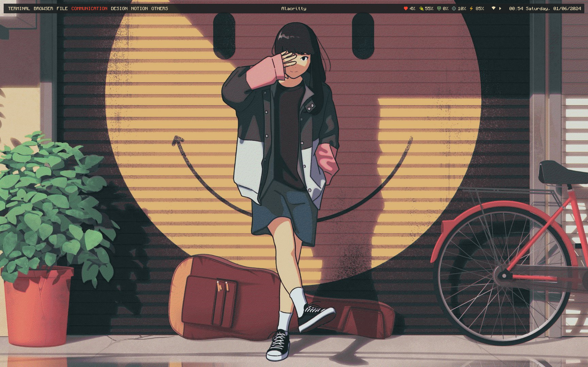
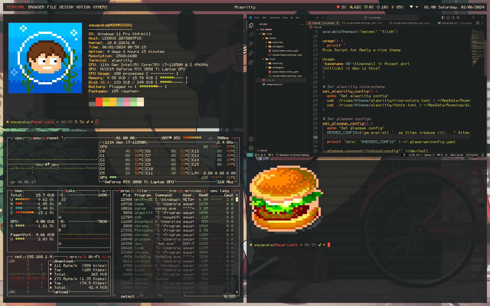
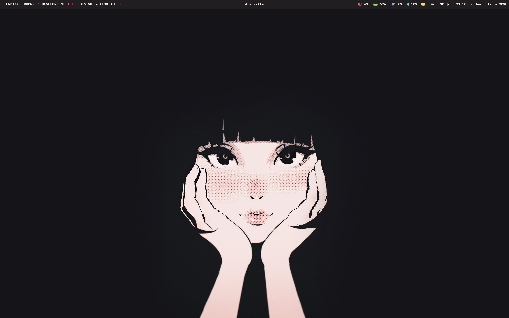
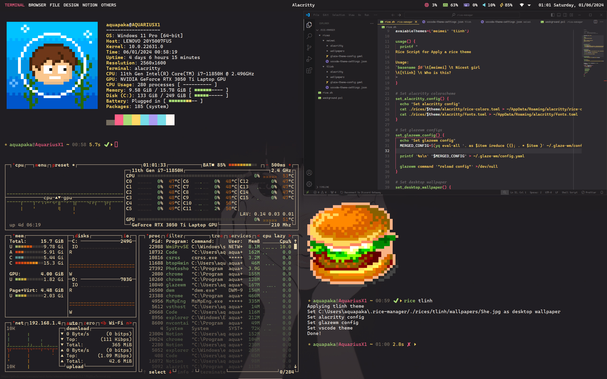

# 🍙 My Ricing Dotfiles for Windows 11

Yes it's **Windows**

## Introduction

### ❤️ For the Ricing and Unixporn Enthusiasts

Are you **a ricing nerd** or **a unixporn enthusiast** who has to use Windows but still misses the customizability of Linux? Look no further! This repository is a treasure trove of my ricing dotfiles tailored specifically for Windows.

### ⚙️ Custom Themes and Configurations

It includes a variety of custom themes, scripts, and configurations designed to bring the same level of aesthetic appeal and functionality to your Windows desktop that you love from your Linux setups.

### ⚡ Instant Theme Switching

Easily switch themes on the fly with just one press. Keep your desktop fresh and aligned with your mood or preferences instantly and effortlessly.

### 😍 Transform Your Windows Experience

Dive in, tweak to your heart's content, and transform your Windows environment into a beautifully riced masterpiece!

## Core

- Terminal: **Alacritty**
- Shell: **Zsh** inside MSYS2
- WM/Bar: **GlazeWM**
- Package manager: **Winget**
- Dotfiles management: **Chezmoi**

## 🎨 Themes

| ❤️ Meimei |
| :---: |
||
||

| ❤️ Tlinh |
| :---: |
||
||

## ⚙️ Current Configurable Settings

You can customize each theme inside ~/.rice-manager/rices and re-apply it (see **Change theme** below)

- ☑️ Alacritty theme
- ☑️ GlazeWM theme
- ☑️ Random desktop wallpaper based on rice
- ☑️ Vscode theme
- ❓ Discord theme
- 🚧 *under construction*

## 📑 Basic usage

### Change theme

- From Alacritty terminal use command: ```rice <theme-name>``` (example: ```rice meimei```)
- Background is selected randomize

### Useful keybindings

| Keys | Action |
|:-|:-|
|<kbd>alt</kbd> + <kbd>enter</kbd>| Open alacritty terminal|
|<kbd>alt</kbd> + <kbd>h\|j\|k\|l</kbd>| Focus window left \| top \| bottom \| right|
|<kbd>alt</kbd> + <kbd>shift</kbd> + <kbd>h\|j\|k\|l</kbd>| Move focusing window left \| top \| bottom \| right|
|<kbd>alt</kbd> + <kbd>w</kbd>| Close focusing window|
|<kbd>alt</kbd> + <kbd>1\|2\|3\|4\|5\|6\|7\|8\|9\|0</kbd>| Focus workspace {n}|
|<kbd>alt</kbd> + <kbd>shift</kbd> + <kbd>1\|2\|3\|4\|5\|6\|7\|8\|9\|0</kbd>| Move current window to workspace {n}|
|<kbd>alt</kbd> + <kbd>m</kbd>| Maximize/Unmaximize current window|
|<kbd>alt</kbd> + <kbd>d</kbd>| Change direction where the next window open should be placed|
|<kbd>alt</kbd> + <kbd>f</kbd>| Make focusing window float/unfloat|
|<kbd>ctrl</kbd> + <kbd>alt</kbd> + <kbd>shift</kbd> + <kbd>w</kbd>| Exit glazewm |

Above is customized version of i3 keybindings due to some conflict with Powertoys. You can alway change them in your glaze config file.

## 📦 Step by Step Installation

### Install Font

Font need to be download and install manually:

- [Pixelcraft Nerd Font](https://github.com/aquapaka/Pixelcraft/releases) (please download and use Nerd Font version)
- [CaskaydiaCove Nerd Font Mono](https://github.com/ryanoasis/nerd-fonts/releases/download/v3.2.1/CascadiaMono.zip)
- [Scientifica](https://github.com/nerdypepper/scientifica/releases) (Optional)

### Install chezmoi and apply dotfiles

- Install chezmoi from Winget with: ```winget install chezmoi```
- Initialize chezmoi and apply the dotfiles with: ```chezmoi init --apply aquapaka```

### Install packages

- After chezmoi apply the dotfiles, the chezmoi source folder could be found in ```%userprofile%/.local/share/chezmoi```, **install-packages.ps1** file can be found inside **scripts** folder
- Edit **install-packages.ps1**, comment out packages/apps that are not needed
- Run **install-packages.ps1** script with Powershell to install nessesary packages (⚠️ Note: sometime installation could fail, keep re-run the script until all packages has been installed)

----------------------------

 *🚩 Continue below after MSYS2 has been installed through install-packages.ps1*

### Change MSYS2 home directory

Edit /c/msys64/etc/nsswitch.conf

```
db_home: windows
```

This will set windows user folder as default home directory

### Install Zsh

Open **Powershell** and run those commands to install Zsh theme and plugins

```
# Install Theme: Powerlevel10k
git clone --depth=1 https://github.com/romkatv/powerlevel10k.git ~/.config/zsh/themes/powerlevel10k

# Install Syntax Highlighting Plugin
git clone https://github.com/zsh-users/zsh-syntax-highlighting.git ~/.config/zsh/plugins/zsh-syntax-highlighting

# Install Autosuggestions Plugin
git clone https://github.com/zsh-users/zsh-autosuggestions ~/.config/zsh/plugins/zsh-autosuggestions

# Install History Substring Search Plugin
git clone https://github.com/zsh-users/zsh-history-substring-search ~/.config/zsh/plugins/zsh-history-substring-search
```

Open **MSYS2 UCRT64** and run below command to install zsh

```
# Open MSYS2 Ucrt64 and install ZSH
pacman -S zsh
```

### Add New Environment Variables

Add "C:\Users\aquapaka\\.local\bin" to Path variables

### Install VS Code Theme

- Icons: [Gruvbox Material Icons](https://marketplace.visualstudio.com/items?itemName=navernoedenis.gruvbox-material-icons)
- Theme:
  - [Gruvbox](https://marketplace.visualstudio.com/items?itemName=jdinhlife.gruvbox)
  - [Monokai Pro](https://marketplace.visualstudio.com/items?itemName=monokai.theme-monokai-pro-vscode)

- To change vscode UI Font, use this extension: [Fonted](https://marketplace.visualstudio.com/items?itemName=degreat.fonted)

### Restore old context menu (Require restart)

- Open/Run **script/Restore-old-context-menu.reg**

### Optional

- Enable automatically hide the taskbar
- Disable rounded corners using: [win11-toggle-rounded-corners](https://github.com/oberrich/win11-toggle-rounded-corners)
### Other

- Food script by Xero: <https://github.com/xero/dotfiles>
