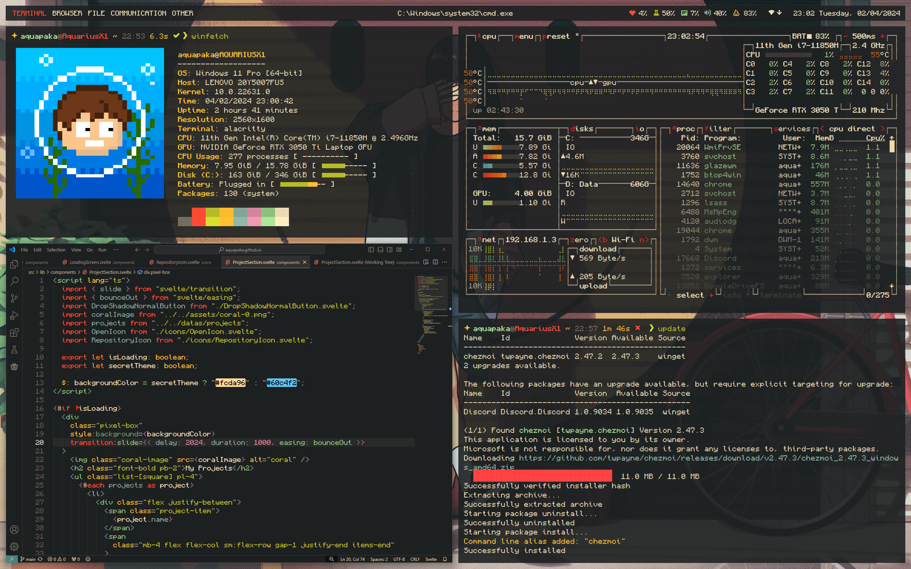

# Dotfiles

My dotfiles for Windows 11

- Terminal: **Alacritty**
- Shell: **Zsh** inside MSYS2
- WM/Bar: **GlazeWM**
- Package manager: **Winget**
- Dotfiles management: **Chezmoi**

## Themes

### ❤️ Meimei Gruvbox





## Installation

### Install Font

Font need to be download and install:

- [Pixelcraft](https://github.com/aquapaka/Pixelcraft/releases): For terminal, code and status bar UI text
- [CozetteVector](https://github.com/slavfox/Cozette/releases): For some additional pixel glyph icons
- [Scientifica](https://github.com/nerdypepper/scientifica/releases): For apps UI font (Vscode, Chrome, etc.)

### Install packages

- Edit **install-packages.ps1**, comment out packages that are not needed
- Run **install-packages.ps1** script with powershell

### Change MSYS2 home directory

Edit /c/msys64/etc/nsswitch.conf

```
db_home: windows
```

### Install Zsh

```
# Open MSYS2 Ucrt64 and install ZSH
pacman -S zsh

# Install Theme: Powerlevel10k
git clone --depth=1 https://github.com/romkatv/powerlevel10k.git ~/.config/zsh/themes/powerlevel10k

# Install Syntax Highlighting Plugin
git clone https://github.com/zsh-users/zsh-syntax-highlighting.git ~/.config/zsh/plugins/zsh-syntax-highlighting

# Install Autosuggestions Plugin
git clone https://github.com/zsh-users/zsh-autosuggestions ~/.config/zsh/plugins/zsh-autosuggestions

# Install History Substring Search Plugin
git clone https://github.com/zsh-users/zsh-history-substring-search ~/.config/zsh/plugins/zsh-history-substring-search
```

### Add New Environment Variables

Add "C:\Users\aquapaka\\.local\bin" to Path variables

### VS Code Theme

- Icons: [Gruvbox Material Icons](https://marketplace.visualstudio.com/items?itemName=navernoedenis.gruvbox-material-icons)
- Theme: [Gruvbox](https://marketplace.visualstudio.com/items?itemName=jdinhlife.gruvbox)
- Change UI Font: [Fonted](https://marketplace.visualstudio.com/items?itemName=degreat.fonted)

### Restore old context menu (Require restart)

- Open/Run **script/Restore-old-context-menu.reg**

### Optional

- Enable automatically hide the taskbar

### Other

- Food script by Xero: <https://github.com/xero/dotfiles>
